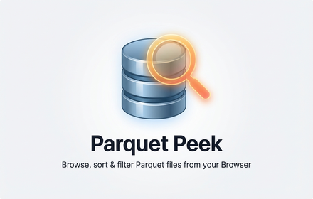

# Parquet Peek



Browse, sort & filter Parquet files from your browser.

## Installation

1. Clone or download this repo
2. Open Chrome and navigate to `chrome://extensions`
3. Enable **Developer mode** (toggle in top right)
4. Click **Load unpacked**
5. Select the `parquet-ext/` folder

## Usage

**From URL:** Click any `.parquet` link and it opens in the viewer.

**From local file:** Open the extension, drag and drop a `.parquet` file.

## Features

- Column sorting (click headers, re-queries via DuckDB)
- Smart filters: dropdowns for categorical, range for numeric, text for strings
- Collapsible schema with column types
- Paginated data table (100 rows per page)
- Load all with progress indicator
- Row numbers, click any cell to copy its value
- Dark mode (automatic via system preference)
- Keyboard shortcuts: `Space` to load more, `Escape` to close
- File size display
- CORS error handling with helpful suggestions

## Test URLs

- https://shell.duckdb.org/data/tpch/0_01/parquet/lineitem.parquet
- https://shell.duckdb.org/data/tpch/0_01/parquet/orders.parquet

## Philosophy

- No AI features
- No analytics
- No graphs
- No accounts
- No cloud sync
- No roadmap

Just parquet viewing.

## Privacy

- Remote parquet files are fetched via HTTP range requests (partial download only)
- All processing happens via DuckDB-wasm in-browser
- No data leaves your machine
- No telemetry, analytics, or tracking
- No external network calls beyond loading DuckDB-wasm from CDN

## Tech

- Chrome Extension (Manifest V3)
- DuckDB-wasm via CDN
- Pure HTML/CSS/JS (no build step)

## Development

```bash
# Run tests
just test
# Create zip for Chrome Web Store
just bundle-for-chrome
# Upload to Chrome Web Store (requires setup)
just publish
```

### Publishing setup

1. Pay the $5 developer fee at [Chrome Web Store Developer Dashboard](https://chrome.google.com/webstore/devconsole)
2. Manually create the first listing (upload zip + screenshots + description)
3. Note your extension ID
4. Create OAuth credentials in [Google Cloud Console](https://console.cloud.google.com/apis/credentials)
5. Fill in `.env` with your credentials (see comments in file for details)
6. Run `just publish`
